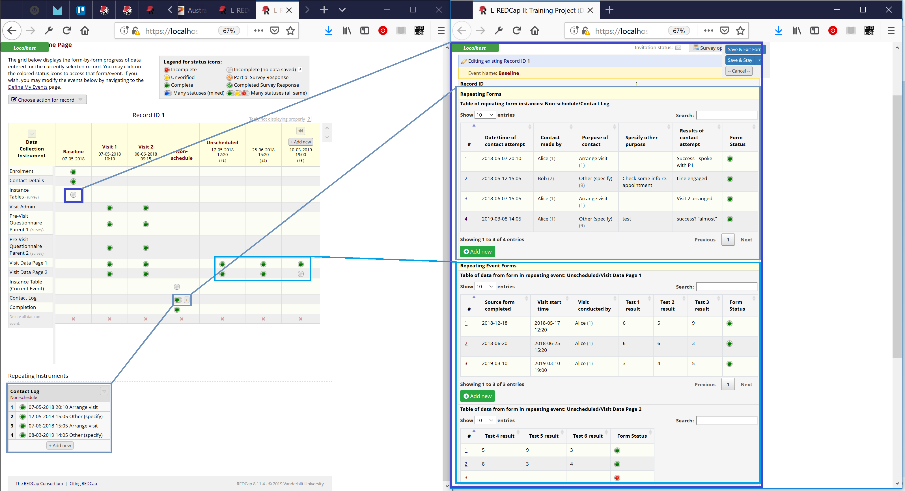

# REDCap External Module: Instance Table

Use the action tag `@INSTANCETABLE=form_name` in a descriptive text field to include a table showing data from repeat instances of that form.

If project is longitudinal, use `@INSTANCETABLE=event_name:form_name` to specify the event and form (can be a repeating form or a form in a repeating event). Event defaults to current event if not specified.

* Add or Edit instances in popup window (View only if user has read-only permission for the repeating form).
* Uses DataTables to facilitate sorting, search and paging within the table of instance data.
* Does not show table for users with no read permission to the repeating form.
* Displays in both regular data entry and survey forms.
* Survey view is read only with no links to the form instances.
* Adds an entry for `@INSTANCETABLE` into the Action Tags dialog on Project Setup and Online Designer pages.

## Additional Action Tags
### Tags Used Alongside @INSTANCETABLE
* `@INSTANCETABLE_SCROLLX`: Default behaviour is for a wide table to cause its container to grow. Use this tag to get a horizontal scroll-bar instead.
* `@INSTANCETABLE_HIDEADD`: Suppress the "Add New" button.
* `@INSTANCETABLE_PAGESIZE`: Override default choices for page sizing: specify integer default page size, or -1 for "All".
* `@INSTANCETABLE_HIDEINSTANCECOL`: Hide the "#" column containing instance numbers.
* `@INSTANCETABLE_VARLIST=rptfrmvar3,rptfrmvar1,rptfrmvar6,rptfrm_complete`: Include only the variables from the repeating form that appear in the comma-separated list. Also (from v1.5.1) can be used to set the order of columns in the table rather than using the order of fields from the form. (An alternative to using `@INSTANCETABLE_HIDE` for repeating form variables. Takes precedence over `@INSTANCETABLE_HIDE`  where both used from v1.5.1.)
* `@INSTANCETABLE_REF=fieldname`: Where you have an instance table on a repeating form - i.e. is referencing another repeating form - you can have the instances filtered to show only those where the current instance number is saved in a field on the other form. For example, an instance table in a repeating "Visit" form may be configured to show only instances of the repeating "Medication" form where the current Visit instance is selected in the `visitref` field on the Medication form: `@INSTANCETABLE @INSTANCETABLE_REF=visitref`. Note that if you use `@INSTANCETABLE_REF` for an instance table on a non-repeating form the filter will default to `<ref field>=1`. New instances created by clicking the "Add New" button below the instance table will have the current visit instance pre-selected.
*  `@INSTANCETABLE_FILTER='[v]="1"'`: Specify a logic expression to show only instances that match the filter expression. 

### Tags Used for Fields on a Repeating Form 
* `@INSTANCETABLE_HIDE`: Ignore this field in instance all tables.
* `@INSTANCETABLE_LABEL='column header'`: Provide an alternative column title for the field in all instance tables.

## Example 
This example shows (on the right-hand side) a form containing three descriptive text fields utilising the `@INSTANCETABLE` action tag. 
* The first is tagged `@INSTANCETABLE=nonschedule_arm_1:contact_log` and hennce displays a table of data from the "Contact Log" form in the "Nonschedule" event".
* The second is tagged `@INSTANCETABLE=unscheduled_arm_1:visit_data_page_1` and hence displays a table of data from the "Visit Data Page 1" form from the repeating "Unscheduled event.
* The third is tagged `@INSTANCETABLE=unscheduled_arm_1:visit_data_page_2` and hence displays a table of data from the "Visit Data Page 2" form from the repeating "Unscheduled event.

